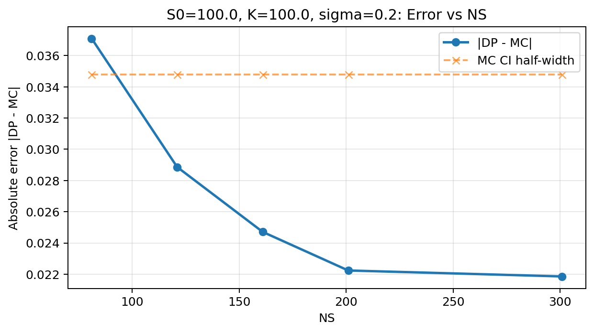
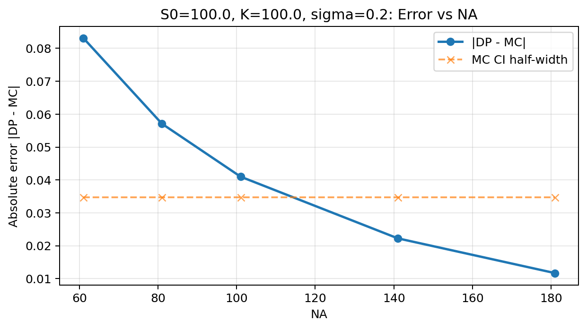

# 🧮 Discrete Dynamic Programming Models for Pricing Asian Exotic Options

This repository implements **discrete dynamic programming (DP)** models for pricing **Asian exotic options** — including **European**, **Bermudan**, and **American** styles.  
It provides validated numerical convergence studies, early-exercise frontier visualizations, early-premium analysis, and full sensitivity overlays.

---

## 📂 Repository Structure

```
.
├── dp_asian.py                 # DP solver engine
├── grids.py                    # Grid construction utilities
├── mc_asian.py                 # Monte Carlo baseline (European Asian)
│
├── convergence_study.py        # DP–MC convergence plots
├── exersize_frontier.py        # Bermudan exercise frontier visualization
├── early_premium.py            # Early-exercise premium vs parameters
├── sensitivity_stats.py        # Overlay sensitivities: Euro vs Berm vs Amer
│
├── figs/                       # Frontier plots (auto-generated)
├── premium_figs/               # Early-premium plots
├── sensitivity_overlay/        # Sensitivity overlay plots
└── convergence_figs/           # Convergence plots
```

---

---

## 🚀 Installation


Clone the repository and install dependencies via `requirements.txt`:

```bash
git clone https://github.com/<your-username>/<repo-name>.git
cd <repo-name>
pip install -r requirements.txt
```


## ⚙️ 1. Core Mathematical Model

We discretize the **state space** \((S, A)\), where:

- **Underlying dynamics:**
  ```math
  S_{t+\Delta t} = S_t \, e^{(r-q-\frac{1}{2}\sigma^2)\Delta t + \sigma\sqrt{\Delta t}\,Z}
  ```

- **Arithmetic average update:**
  ```math
  A_{t+\Delta t} = \frac{kA_t + S_{t+\Delta t}}{k+1}, \quad \text{if } t \text{ is a monitoring date.}
  ```

- **Dynamic programming recursion:**
  ```math
  V_n(S,A) =
  \begin{cases}
  e^{-r\Delta t}\,\mathbb{E}[\,V_{n+1}(S',A')\,], & \text{(continuation)} \\[4pt]
  \max\{\Phi(S,A),\,e^{-r\Delta t}\,\mathbb{E}[V_{n+1}] \}, & \text{(exercise step)}
  \end{cases}
  ```

Expectation E[.] is evaluated using **Gauss–Hermite quadrature** with pre-tabulated nodes and weights.

---

## 🧩 2. Script Summaries and Command-Line Usage

### 🧮 `convergence_study.py` — Numerical Validation

Validates DP solver convergence against Monte Carlo pricing for **European Asian options**.

#### Command-line options
```bash
--param {NS,NA,Kgh}   # which grid parameter to sweep
--values VALS          # comma-separated list of values, e.g. 81,101,121,161,201
--N 60                 # number of time steps (default 60)
--Kgh 7                # number of Gauss–Hermite nodes
--outdir convergence_figs
```
Example:
```bash
python convergence_study.py --param NS --values 81,101,121,161,201,301
```

#### Output
- `convergence_NS.png`, `convergence_NA.png`, `convergence_Kgh.png`
- Each plot shows error |DP − MC| vs parameter.

#### Typical plot




---

### ⚖️ `exersize_frontier.py` — Bermudan Exercise Frontier

Plots the **optimal early-exercise boundary** for a Bermudan Asian put option.

#### Command-line options
```bash
--NS 121        # grid points for S
--NA 101        # grid points for A
--N 60          # time steps
--Kgh 7         # quadrature nodes
--sigma 0.2     # volatility
--K 100         # strike price
--r 0.05        # interest rate
--outdir figs   # output directory
```
Example:
```bash
python exersize_frontier.py --sigma 0.25 --K 100
```

#### Output
Three clean frontier plots at different times:

| Plot | Description |
|------|--------------|
| `frontier_025.png` | Frontier at 25% maturity |
| `frontier_050.png` | Frontier at 50% maturity |
| `frontier_075.png` | Frontier at 75% maturity |

#### Typical plot


**Interpretation:**  
Yellow = exercise region (deep ITM), Purple = continuation region.

---

### 💰 `early_premium.py` — Early-Exercise Premium Analysis

Computes and plots the **early-exercise premium**:
```math
\text{Premium} = V_{\text{Berm/Am}} - V_{\text{Euro}}
```

#### Command-line options
```bash
--do_M          # vary number of time steps / monitoring dates
--do_sigma      # vary volatility
--do_K          # vary strike
--style {berm,amer}    # option style
--freq 5        # Bermudan exercise every `freq` steps
--outdir premium_figs
```

Examples:
```bash
python early_premium.py --do_M --style berm
python early_premium.py --do_sigma --style amer
python early_premium.py --do_K --style berm
```

#### Output
| File | Description |
|------|--------------|
| `premium_vs_M.png` | Premium vs number of time steps |
| `premium_vs_sigma.png` | Premium vs volatility |
| `premium_vs_K.png` | Premium vs strike |

#### Typical plots


**Interpretation:**
- Premium increases with volatility (more uncertainty → more optionality).  
- Premium decreases with more averaging (less volatility).  
- Peak premium near ATM (K ≈ S₀).

---

### 📊 `sensitivity_stats.py` — Multi-Style Sensitivity Overlay

Generates **overlay charts** for European, Bermudan, and American Asian options.

#### Command-line options
```bash
--sigmas 0.10,0.20,0.30,0.40,0.50
--rates 0.00,0.02,0.05,0.08
--strikes 80,90,100,110,120
--M_list 12,24,52
--berm_freq 5
--NS 121 --NA 101 --N 60 --Kgh 7
--outdir sensitivity_overlay
```

#### Example
```bash
python sensitivity_stats.py
```

#### Output
| File | X-axis | Description |
|------|---------|-------------|
| `price_vs_sigma.png` | Volatility | Price ↑ with σ |
| `price_vs_r.png` | Interest rate | Drift and discounting effects |
| `price_vs_K.png` | Strike | Price ↓ with K |
| `price_vs_M.png` | Time steps (M=N) | Combined effect of averaging + granularity |

#### Typical plots


**Interpretation:**

(V<sub>Euro</sub> ≤ V<sub>Berm</sub> ≤ V<sub>Amer</sub>)
---

## 📈 3. Typical Observations

| Feature | Observation |
|----------|--------------|
| **Convergence** | DP error stabilizes within Monte Carlo 95% CI. |
| **Frontier** | Smooth inward-moving early-exercise boundary. |
| **Premium vs σ** | Grows rapidly with volatility. |
| **Premium vs M** | Declines with finer averaging. |
| **Sensitivity overlays** | Maintain hierarchy \(V_{Euro} < V_{Berm} < V_{Amer}\). |

---

## 📘 4. Theoretical Insights

- Using **log-spaced grids** for \(S\) and **linear grids** for \(A\) improves numerical stability.
- Gauss–Hermite quadrature with \(K_{gh} \in [5,9]\) nodes provides fast, accurate expectations.
- Early exercise decisions are purely **local**, based on comparing continuation and immediate payoff values.
- The **Bermudan–American difference** shrinks rapidly as the DP time grid \(N\) increases.

---

## 🧪 5. Example Reproduction Workflow

1. Run convergence validation:
   ```bash
   python convergence_study.py --param NS --values 81,121,161,201,301
   python convergence_study.py --param NA --values 61,81,101,141,181
   python convergence_study.py --param Kgh --values 3,5,7
   ```
2. Generate Bermudan frontiers:
   ```bash
   python exersize_frontier.py
   ```
3. Compute early-exercise premium curves:
   ```bash
   python early_premium.py --do_M
   python early_premium.py --do_sigma 
   python early_premium.py --do_K 
   ```
4. Produce multi-style overlays:
   ```bash
   python sensitivity_stats.py
   ```

---

## 📜 6. References

- Rogers & Shi (1995), *The Value of an Asian Option*, J. Appl. Prob.  
- Hull (2020), *Options, Futures, and Other Derivatives*.  
- Carverhill (1992), *Discrete Dynamic Programming for Option Pricing*.


